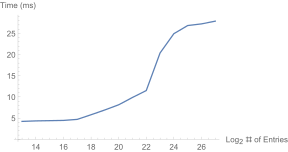
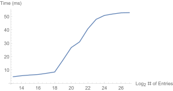

# Hashbrown Benchmark

Check the impact of hashmap sizes on the performance of hashmap lookups.

## Run

```console
$ cargo bench -- --quiet
```

## Results

CPU: Ryzen 3700X

### Find 1M Random Keys



<details>
  <summary>Click me</summary>

```text
[random] 2^13 entries   time:   [4.2082 ms 4.2197 ms 4.2339 ms]

[random] 2^14 entries   time:   [4.3163 ms 4.3382 ms 4.3634 ms]

[random] 2^15 entries   time:   [4.3753 ms 4.3949 ms 4.4168 ms]

[random] 2^16 entries   time:   [4.4192 ms 4.4505 ms 4.4866 ms]

[random] 2^17 entries   time:   [4.6452 ms 4.6968 ms 4.7545 ms]

[random] 2^18 entries   time:   [5.7159 ms 5.7920 ms 5.8720 ms]

[random] 2^19 entries   time:   [6.8523 ms 6.9242 ms 7.0009 ms]

[random] 2^20 entries   time:   [8.0416 ms 8.1426 ms 8.2457 ms]

[random] 2^21 entries   time:   [9.6515 ms 9.8732 ms 10.115 ms]

[random] 2^22 entries   time:   [11.315 ms 11.506 ms 11.709 ms]

[random] 2^23 entries   time:   [20.175 ms 20.384 ms 20.607 ms]

[random] 2^24 entries   time:   [24.855 ms 24.940 ms 25.044 ms]

[random] 2^25 entries   time:   [26.532 ms 26.859 ms 27.237 ms]

[random] 2^26 entries   time:   [27.130 ms 27.250 ms 27.390 ms]

[random] 2^27 entries   time:   [27.654 ms 27.897 ms 28.200 ms]
```

</details>

### Find 1M Existing Keys



<details>
  <summary>Click me</summary>

```text
[exist] 2^13 entries    time:   [4.9717 ms 4.9936 ms 5.0189 ms]

[exist] 2^14 entries    time:   [5.6919 ms 5.7200 ms 5.7522 ms]

[exist] 2^15 entries    time:   [6.2125 ms 6.2310 ms 6.2512 ms]

[exist] 2^16 entries    time:   [6.6175 ms 6.6335 ms 6.6527 ms]

[exist] 2^17 entries    time:   [7.4603 ms 7.5192 ms 7.5813 ms]

[exist] 2^18 entries    time:   [8.3801 ms 8.5009 ms 8.6404 ms]

[exist] 2^19 entries    time:   [17.270 ms 17.471 ms 17.705 ms]

[exist] 2^20 entries    time:   [26.648 ms 26.795 ms 26.948 ms]

[exist] 2^21 entries    time:   [30.774 ms 31.008 ms 31.257 ms]

[exist] 2^22 entries    time:   [40.386 ms 40.780 ms 41.194 ms]

[exist] 2^23 entries    time:   [47.625 ms 47.886 ms 48.191 ms]

[exist] 2^24 entries    time:   [50.583 ms 50.796 ms 51.028 ms]

[exist] 2^25 entries    time:   [51.743 ms 51.868 ms 52.011 ms]

[exist] 2^26 entries    time:   [52.422 ms 52.701 ms 53.085 ms]

[exist] 2^27 entries    time:   [52.760 ms 52.847 ms 52.949 ms]
```

</details>

## License

This project is licensed under either of

- Apache License, Version 2.0, ([LICENSE-APACHE](/LICENSE-APACHE) or [http://www.apache.org/licenses/LICENSE-2.0](http://www.apache.org/licenses/LICENSE-2.0))
- MIT license ([LICENSE-MIT](/LICENSE-MIT) or [http://opensource.org/licenses/MIT](http://opensource.org/licenses/MIT))

at your option.
